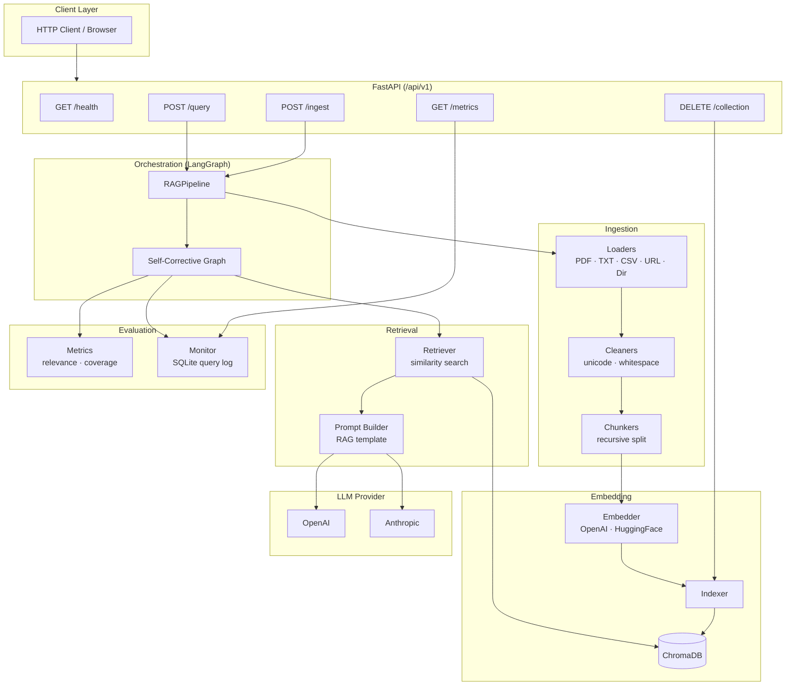
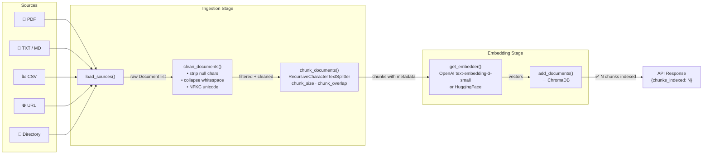
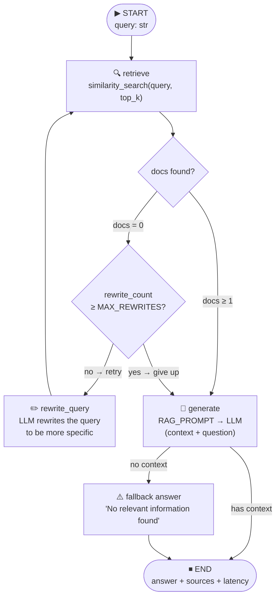
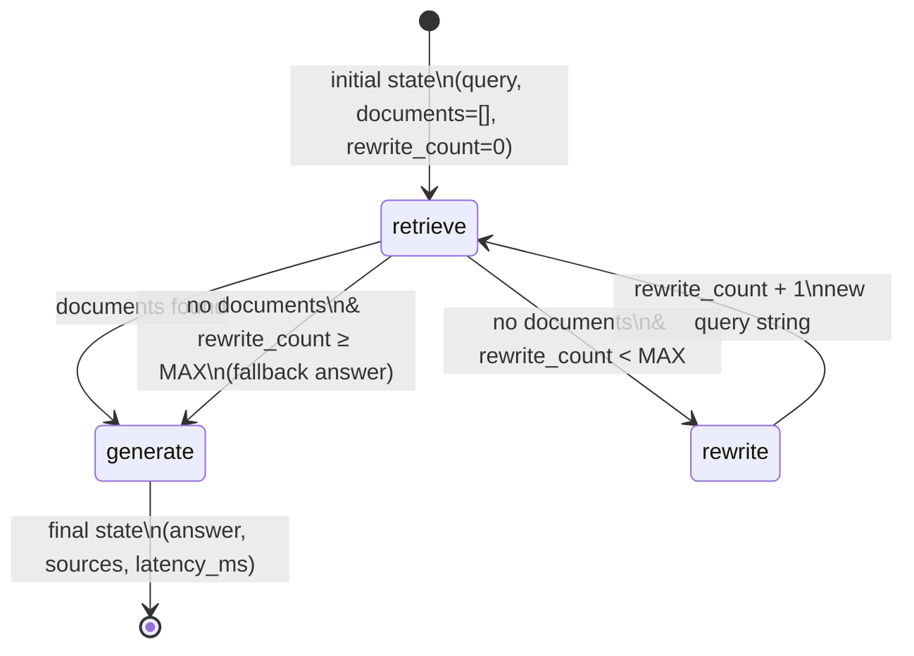
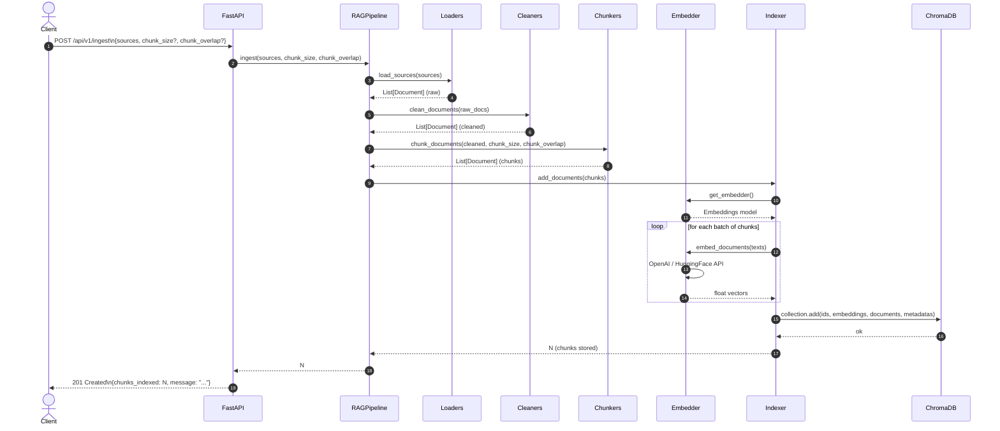
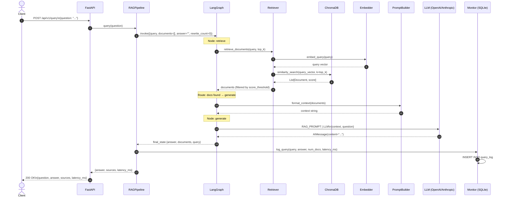
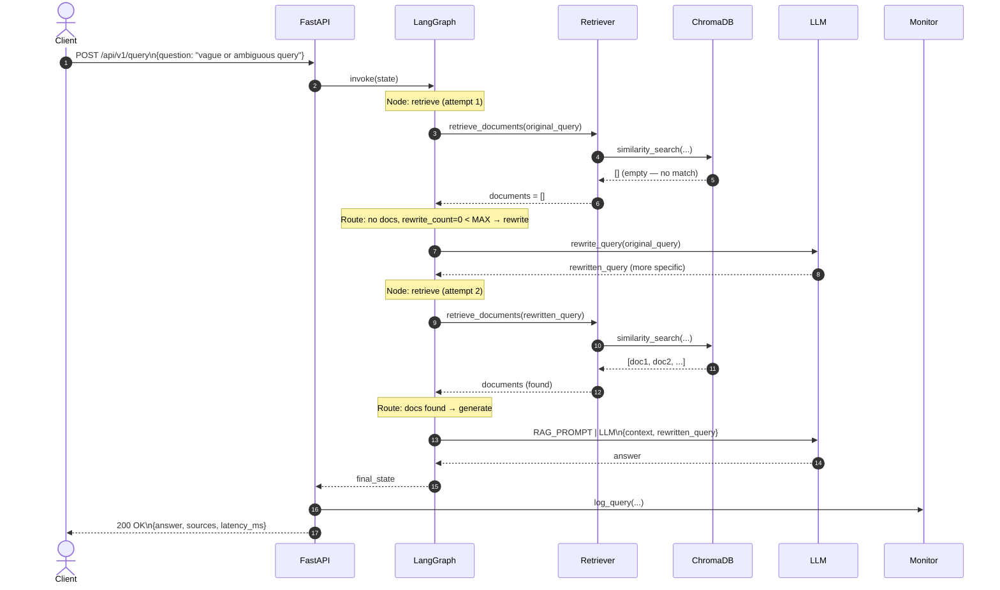
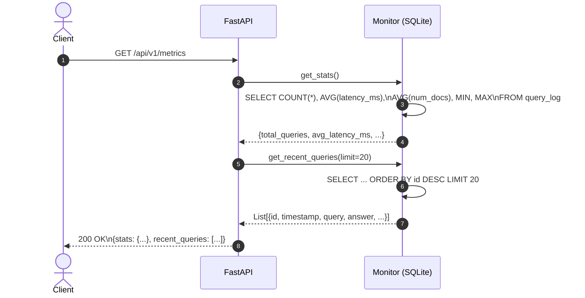

# RAG Pipeline — Flow & Sequence Diagrams

All diagrams use [Mermaid](https://mermaid.js.org/) and render natively on GitHub.

---

## 1. System Architecture Overview



---

## 2. Document Ingestion Flow



---

## 3. Self-Corrective RAG Query Flow (LangGraph)



---

## 4. LangGraph State Machine



---

## 5. Sequence Diagram — POST /ingest



---

## 6. Sequence Diagram — POST /query (happy path)



---

## 7. Sequence Diagram — POST /query (self-correction path)



---

## 8. Sequence Diagram — GET /metrics



---

## 9. Component Dependency Graph

```mermaid
flowchart BT
    config["⚙️ config.py\nSettings"]

    loaders["loaders.py"] --> config
    cleaners["cleaners.py"]
    chunkers["chunkers.py"] --> config

    embedder["embedder.py"] --> config
    indexer["indexer.py"] --> config
    indexer --> embedder

    retriever["retriever.py"] --> config
    retriever --> indexer
    prompt_builder["prompt_builder.py"]

    llm["_llm.py"] --> config
    graph["graph.py"] --> retriever
    graph --> prompt_builder
    graph --> llm
    graph --> config

    pipeline["pipeline.py"] --> loaders
    pipeline --> cleaners
    pipeline --> chunkers
    pipeline --> indexer
    pipeline --> graph
    pipeline --> monitor

    metrics["metrics.py"]
    monitor["monitor.py"] --> config

    schemas["schemas.py"]
    routes["routes.py"] --> pipeline
    routes --> monitor
    routes --> indexer
    main["main.py"] --> routes
    main --> config
```
